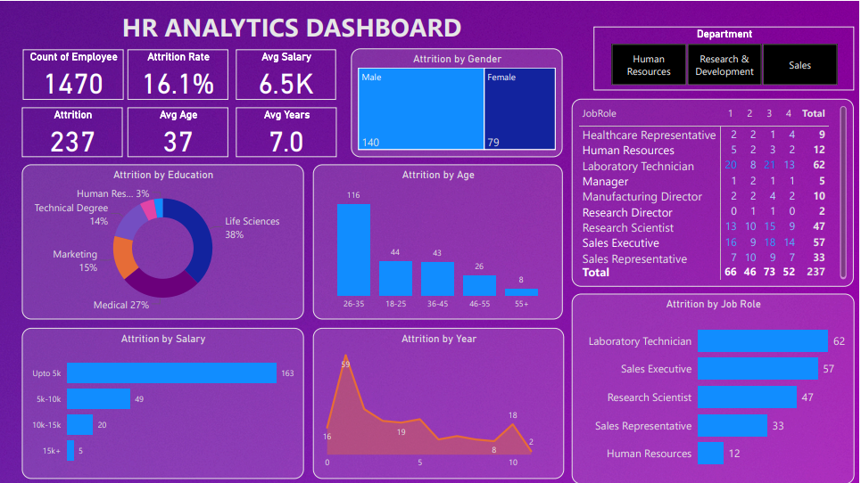

# HR Analytics Dashboard

## Overview

This project involves creating an HR Analytics Dashboard using Power BI. The dashboard provides comprehensive insights into employee attrition across various dimensions such as gender, age, education, salary, job role, and department. The goal is to help HR professionals identify key areas to address and improve employee retention strategies.

## Key Features

- **Total Employee Count**: 1470
- **Attrition Rate**: 16.1%
- **Average Salary**: 6.5K
- **Average Age**: 37 years
- **Average Tenure**: 7 years

## Detailed Analytics

- **Attrition by Gender**: Visual representation of employee attrition split by gender.
- **Attrition by Education**: Pie chart showing the distribution of attrition based on different education backgrounds.
- **Attrition by Age Group**: Bar chart depicting attrition across various age groups.
- **Attrition by Salary Range**: Bar chart illustrating attrition across different salary ranges.
- **Attrition by Job Role**: Bar chart showing attrition across different job roles.
- **Attrition by Department and Year**: Line chart and matrix showing attrition across departments and over the years.

## Tools and Technologies Used

- **Power BI**: For creating and visualizing the dashboard.
- **Excel/CSV**: For data storage and manipulation.

